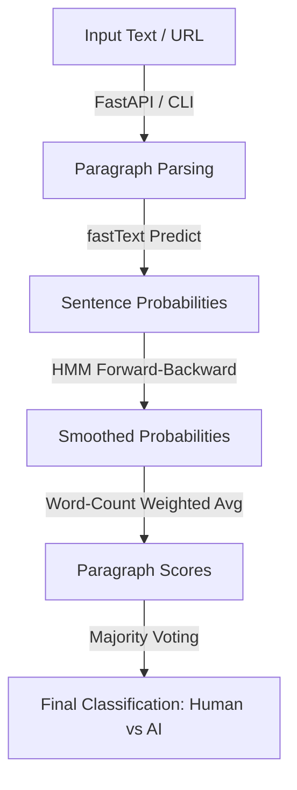

# Sulku 🌌

[](https://python.org)
[](https://github.com/Klikkikuri)

**Sulku** (Finnish for *gate* or *closure*) is the text classification, synthetic dataset generation, and AI-detection pipeline of the **[Klikkikuri](https://github.com/Klikkikuri)** project. Klikkikuri is an open-source initiative and browser extension designed to detect and correct sensation-seeking clickbait headlines. Sulku supports this mission by providing robust tools to identify machine-generated (synthetic) text, build synthetic training corpora, and verify content authenticity.

> [!IMPORTANT]
> Sulku is **not** designed or intended to be a foolproof AI detection system.
> It's primary aim is to identify **low-effort, automated AI-generated content** (e.g., mass-produced synthetic
> news feeds). Human-edited hybrid content falls outside this scope; if a human has manually edited or revised a
> text, it implies a level of human effort and intention that distinguishes it from purely automated content.
> As with all stylometric classifiers, Sulku is susceptible to manual editing, human modifications, and adversarial
> formatting (such as prompt engineering designed to bypass detection, paraphrasing, or rewriting).

## 🏗️ Detection Pipeline Architecture



## ✨ Key Features

- Leverages **multiple fastText models** concurrently to improve accuracy. Different generator models (e.g., various LLMs) have distinct stylistic tells and fixations; an ensemble approach aggregates these differences to form a more robust detection mechanism.
- Applies a Hidden Markov Model (HMM) **forward-backward smoothing algorithm over sentence-level predictions** to capture structural transitions and mitigate noisy/degenerate sentence scores. For low-effort content, the HMM assumes that if a sentence is generated by AI, the surrounding sentences are highly likely to be AI-generated as well.
- Segments documents into paragraphs and sentences, scoring paragraphs individually and aggregating them using word-count weights.
- Exposes a service to **fetch Wikipedia pages at specific points in time**, performing vandalism checks by inspecting editor revert rates and recent edit histories.
- Samples real news articles, generates semantic summaries using LLMs, and **generates style-mirrored synthetic articles**.
- Converts large Finnish Yle news JSON archives into structured Markdown with YAML front matter metadata, filtering out media placeholders, widgets, twitter embeds, and other noise. *Note: Scrambled Yle datasets (where sentence or paragraph order is randomized) can be successfully used to train models, since the underlying fastText classification operates at the sentence level.*

## 📄 Expected Document Formats for training

Sulku processes both human-written and synthetic news articles as Markdown files containing YAML front matter
metadata blocks. The schema for these metadata blocks is defined in [models.py](file:///app/src/sulku/dataset/models.py).

### Document Format

Human-written articles are expected to contain metadata conforming to the
[FrontMatter](file:///app/src/sulku/dataset/models.py) TypedDict:

- **YAML Front Matter**:
  - `language` or `lang` (Required for language filtering): e.g., `fi` or `en`.
  - `id` (Optional): Unique identifier of the article.
  - `title` (Optional): Title/headline.
  - `url` (Optional): Source link.
  - `datePublished` (Optional): Publication timestamp.
  - `dateModified` (Optional): Last modification timestamp.
  - `authors` (Optional): List of authors, where each author is an object containing `name` and optional `organization`.
  - `subjects` (Optional): List of tags/subjects.
- **Body Content**: The plain text body of the article starts immediately following the closing `---` boundary.

Example human document:
```markdown
---
id: "20-307177"
title: "Opettajatar rakastuu nuoreen oppilaaseen..."
url: https://yle.fi/...
language: fi
authors:
  - name: Harto Hänninen
    organization: Yle
subjects:
  - "elokuvat"
---
# Et ole uskoa silmääsi, kun näet tämän!

Body content goes here...

Watch now at [Yle Areena](https://areena.yle.fi/1-307177).
```

## 🚀 Installation & Setup

> [!IMPORTANT]
> Running, developing, and building the application is only supported inside containers.

### 🐳 Building and Running with Docker

1. **Clone the repository**:
   ```bash
   git clone https://github.com/Klikkikuri/sulku.git
   cd sulku
   ```

2. **Configure Environment Variables**:
   Create a `.env` file in the root directory, with either your OpenAI API key or Gemini API key. Using the OpenAI client library environment variable overrides are supported.
   ```env
   OPENAI_API_KEY=your-openai-key
   GEMINI_API_KEY=your-gemini-key
   ```

3. **Build the Environment**:
   - You can build the production-ready stage of the multi-stage Dockerfile directly:
     ```bash
     docker build --target build -t sulku:latest -f .devcontainer/Dockerfile .
     ```
   -  For development, you can build the development stage:
     ```bash
     docker build --target development -t sulku-dev:latest -f .devcontainer/Dockerfile .
     ```

## 💻 Command Line Interface (CLI)

The CLI tool is exposed via the `sulku` script command. Run all commands with `[uv run] sulku`.

Start the HTTP API Server:
```bash
uv run sulku serve --host 127.0.0.1 --port 8000
```

Submit a local text file or a public URL to the detection service:
```bash
# Analyze a local file
uv run sulku detect /path/to/article.md

# Analyze a web page (fetched and cleaned automatically)
uv run sulku detect https://yle.fi/a/74-20100000
```

Extract a random sample of $N$ articles from a dataset directory:
```bash
uv run sulku sample /app/data/huuman -n 50 --language fi --min-words 100
```


Sample human-written articles from a source folder and generate corresponding synthetic articles.
```bash
uv run sulku generate-synthetic /app/data/huuman -n 10 --model gemini-3.1-flash-lite
```

> [!NOTE]
> Scrambled datasets (where sentence or paragraph order has been randomized, for licensing or privacy compliance) can be used to train models without any loss in performance. This is because Sulku prepares data and trains fastText classifiers on a sentence-by-sentence basis rather than document-level sequences.

Extract sentences from Markdown datasets and format them for fastText training (attaching labels):
```bash
# Prepare human training data
uv run sulku generate-fasttext /app/data/huuman -o data/train.txt --label human --lang fi

# Prepare synthetic training data (append mode)
uv run sulku generate-fasttext /app/data/genai/gemini-3.1-flash-lite -o data/train.txt --label synthetic --lang fi --append
```

## Train fastText Classifier

See the [train.ipynb](notebooks/train.ipynb) notebook for an example of training a fastText classifier on paired human and synthetic datasets.
